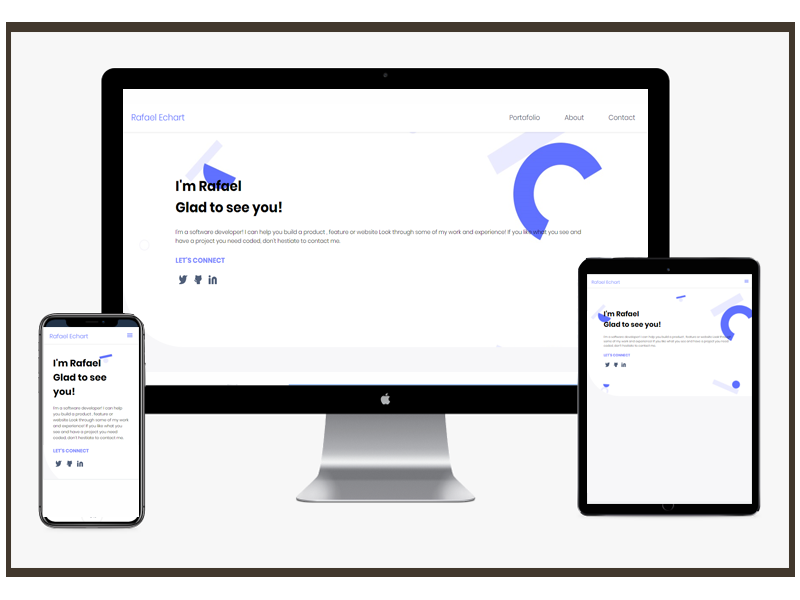

# Personal Portfolio

> This is the first draft for my personal portfolio, it's going to be a one page website with all of my personal work! I hope you like it!

This HTML and CSS website shows a first screen and responsive menu, when you are on a Desktop computer has one view and from table to cellphone the menu is a dropdown!

## Built With

- HTML & CSS
- Linters
- Git & Github

## Built With

- https://rafaelechart.github.io/PersonalPortfolio/

## Getting Started

To get a local copy up and running follow these simple example steps.

### Prerequisites

- Git in your local machine
- Code editor (VS code, Atom, etc)
- Terminal

### Setup

- git clone https://github.com/RafaelEchart/PersonalPortfolio.git
- cd PersonalPortfolio

### Usage

- Add the changes you want and feel free to push it into a new Branch!

### Run tests

- Check that all the tests are correctly passed🤝

### Merge

- Merge it with the main branch so we can all see your work!!🤝

## Authors

👤 **Author**

- GitHub: [@rafaelechart](https://github.com/rafaelechart)
- Twitter: [@rafaechart](https://twitter.com/rafaechart)

## 🤝 Contributing

Contributions, issues, and feature requests are welcome!

## Show your support

Give a ⭐️ if you like this project!

## Acknowledgments

- Microverse documentation and Myself ⭐️

## 📝 License

This project is [MIT](./MIT.md) licensed.
